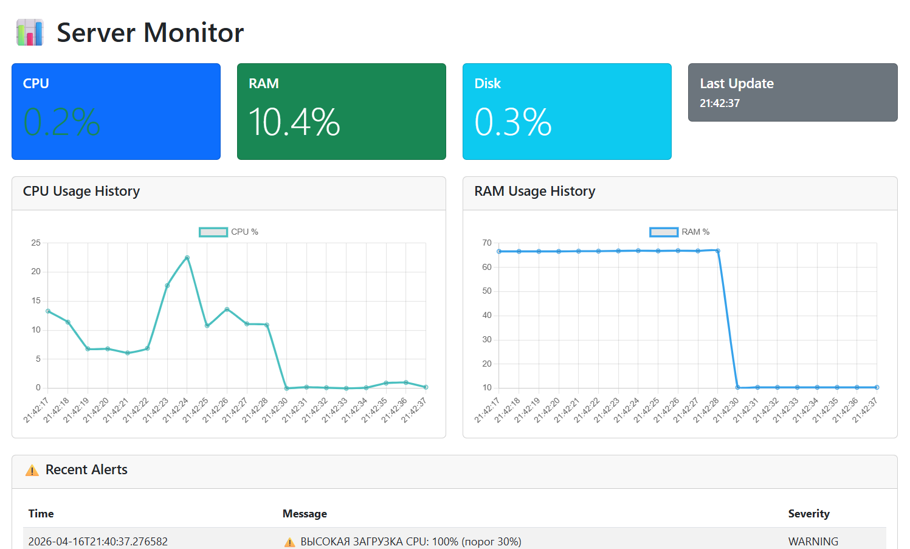

# Server Monitor

Система мониторинга сервера с веб-интерфейсом и Telegram-ботом.
---


*Веб-интерфейс с графиками CPU/RAM/диска*

## Возможности

 - Мониторинг CPU, RAM, диска в реальном времени
 - Графики нагрузки (история до 20 точек)
 - Логирование алертов в базу данных
 - Telegram-бот для удалённого управления и уведомлений
 - Готов к запуску в Docker

 ---
<details>
<summary> Быстрый старт (Docker) </summary>

### 1. Клонируй репозиторий

 ```bash
 git clone https://github.com/oalaov/server_monitor.git && cd server_monitor
 ```

### 2. Создай файл .env с текстом ниже и замени токен бота, chat id, имя пользователя и пароль от веба на нужные
 ```bash
 TELEGRAM_BOT_TOKEN=ТВОЙ:ТОКЕН
 CHAT_ID=ТВОЙCHATID
 ADMIN_USERNAME=ИМЯ_ПОЛЬЗОВАТЕЛЯ
 ADMIN_PASSWORD=ПАРОЛЬ
 ```

### 3. Установи Docker 

- Windows: https://docs.docker.com/desktop/setup/install/windows-install/
- macOS: https://docs.docker.com/desktop/setup/install/mac-install/
- Linux: https://docs.docker.com/desktop/setup/install/linux/

### 4. Установи node exporter 

 - Windows: https://github.com/prometheus-community/windows_exporter
 - Linux/macOS https://prometheus.io/download/#node_exporter 


### 5. Запусти одной командой 
 ```bash
 docker-compose up -d
 ```

### 6. Телеграм бот и веб
 1. Открой своего бота и отправь /start
 2. Открой в браузере
 
 ```bash
 http://localhost:5000
 
